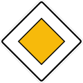

# **Traffic Sign Recognition** 

## Writeup

### You can use this file as a template for your writeup if you want to submit it as a markdown file, but feel free to use some other method and submit a pdf if you prefer.

---

**Build a Traffic Sign Recognition Project**

The goals / steps of this project are the following:
* Load the data set (see below for links to the project data set)
* Explore, summarize and visualize the data set
* Design, train and test a model architecture
* Use the model to make predictions on new images
* Analyze the softmax probabilities of the new images
* Summarize the results with a written report

[//]: # (Image References)

[image1]: Results/histogramplot.png "Visualization"
[image2]: Results/RGB2Grayimg.png"Grayscaling"
[image3]: Results/Augumentaionimg.png "Augumentaion"
[image4]: Results/histogramAfterAugmentation.png "dataAfterAugumentation"
[image5]: OnlineImages/Priorityroad.png "Traffic Sign 1"
[image6]: OnlineImages/Round.png "Traffic Sign 2"
[image7]:  OnlineImages/speed_60.png "Traffic Sign 3"
[image8]:  OnlineImages/Trafficsigns.png "Traffic Sign 4"
[image9]:  OnlineImages/wildAnimal.png "Traffic Sign 5"
[image10]: Results/NewImgVisu.png "NewImagePrediction"

## Rubric Points
### Here I will consider the [rubric points](https://review.udacity.com/#!/rubrics/481/view) individually and describe how I addressed each point in my implementation.  

---
### Writeup / README

#### 1. Provide a Writeup / README that includes all the rubric points and how you addressed each one. You can submit your writeup as markdown or pdf. You can use this template as a guide for writing the report. The submission includes the project code.

You're reading it! and here is a link to my [project code](https://github.com/WatermelonCircle/CarND_traffic_sign_classifier/blob/master/Traffic_Sign_Classifier.ipynb)

### Data Set Summary & Exploration

#### 1. Provide a basic summary of the data set. In the code, the analysis should be done using python, numpy and/or pandas methods rather than hardcoding results manually.

I used the pandas library to calculate summary statistics of the traffic
signs data set:

* The size of training set is 34799
* The size of the validation set is 4410
* The size of test set is 12630
* The shape of a traffic sign image is 32,32,3
* The number of unique classes/labels in the data set is 43

#### 2. Include an exploratory visualization of the dataset.

Here is an exploratory visualization of the data set. It is a bar chart showing how the data ...

### Design and Test a Model Architecture

#### 1. Describe how you preprocessed the image data. What techniques were chosen and why did you choose these techniques? Consider including images showing the output of each preprocessing technique. Pre-processing refers to techniques such as converting to grayscale, normalization, etc. (OPTIONAL: As described in the "Stand Out Suggestions" part of the rubric, if you generated additional data for training, describe why you decided to generate additional data, how you generated the data, and provide example images of the additional data. Then describe the characteristics of the augmented training set like number of images in the set, number of images for each class, etc.)

I tried both grayscale and RGB to feed the model later. For both gray and RGB image I normalized by 128.

Here is an example of a traffic sign image before and after grayscaling.

Since the some traffic signs has much less data than other, so I also did image augumention(rotation, affine transform and translation) by static or dynamic fashion to train the model later, but found out the either of them doesnt really helpful. So the final model didnt implement the data augumentaion. Here is example of image augumented data:

Here is an example of an original image and an augmented image:

#### 2. Describe what your final model architecture looks like including model type, layers, layer sizes, connectivity, etc.) Consider including a diagram and/or table describing the final model.

My final model consisted of the following layers:

| Layer         		|     Description	        					| 
|:---------------------:|:---------------------------------------------:| 
| Input         		| 32x32x3 RGB image   							| 
| Convolution 5x5     	| 1x1 stride, same padding, outputs 28x28x6 	|
| RELU					|												|
| Max pooling	      	| 2x2 stride,  output 14x14x16  				|
| Convolution 5x5	    | 1x1 stride,  output 10x10x16  				|
| Max pooling    		| 2x2 stride,  output 5x5x16      				|
| Fully connected		| input 400,   output 120    					|
| RELU					|												|
| Fully connected		| input 120,   output 84						|
| RELU   				| 												|
| Fully connected		| input 84,    output 43						|
| softmax	        	|  												|

#### 3. Describe how you trained your model. The discussion can include the type of optimizer, the batch size, number of epochs and any hyperparameters such as learning rate.

To train the model, I used an adamgrad optimizer with learing rate of 0.01~0.2, I chose 0.15 evtually. I tried batch size from 32~128, chose 64. number of epochs 20~80, chose 40

#### 4. Describe the approach taken for finding a solution and getting the validation set accuracy to be at least 0.93. Include in the discussion the results on the training, validation and test sets and where in the code these were calculated. Your approach may have been an iterative process, in which case, outline the steps you took to get to the final solution and why you chose those steps. Perhaps your solution involved an already well known implementation or architecture. In this case, discuss why you think the architecture is suitable for the current problem.

I started with the standard lenet configuration, and then found the model is overfitting because training accuracy(~99%) is higher than validation accuracy (~89%). Then I tried the following steps:
* I tried dropout after the first convolution layer, but it turned out reducing the accuracy both for training and validation so I gave up on dropout
* I tried L2 regularizatin to reduce the overfitting, tried beta from 0.0001~0.1. found 0.001 gave me best training accuracy and validation accuracy (~94%) 
* I tried data augmention by increasing the number of those signs which has much less in the data base. the following histogram shown the before and after data augumentation. However the data augumentation doesnt really help on improving the model accuracy, so it is not implemented in the final model 

My final model results were:
* training set accuracy of 0.999
* validation set accuracy of 0.934 
* test set accuracy of 0.917

If an iterative approach was chosen:
* What was the first architecture that was tried and why was it chosen?
* What were some problems with the initial architecture?
* How was the architecture adjusted and why was it adjusted? Typical adjustments could include choosing a different model architecture, adding or taking away layers (pooling, dropout, convolution, etc), using an activation function or changing the activation function. One common justification for adjusting an architecture would be due to overfitting or underfitting. A high accuracy on the training set but low accuracy on the validation set indicates over fitting; a low accuracy on both sets indicates under fitting.
* Which parameters were tuned? How were they adjusted and why?
* What are some of the important design choices and why were they chosen? For example, why might a convolution layer work well with this problem? How might a dropout layer help with creating a successful model?

If a well known architecture was chosen:
* What architecture was chosen?
I chose lenet 
* Why did you believe it would be relevant to the traffic sign application?
because lenet has good accuracy on letters and numbers. The traffic sign are simple structure like letter and number, the LEnet should be good enough

* How does the final model's accuracy on the training, validation and test set provide evidence that the model is working well?
 The model still overfitting according to the final accuracy, but the all validation accuracy are above 0.93.

### Test a Model on New Images

#### 1. Choose five German traffic signs found on the web and provide them in the report. For each image, discuss what quality or qualities might be difficult to classify.

Here are five German traffic signs that I found on the web:

   
 

The first image is easy to predict due to the unique shape of the animal. 
The second image has curved arrows, which is difficult to predict
The thrid pic is easy but may be confused with general caution sigh
The fourth image is relative easy to predict, but may be confuse with speed limit 50 since 60 and 50 has very similar shape
The fifth has 90 degree angles at 4 corners, which may be confused with many other sharp angle shapes

#### 2. Discuss the model's predictions on these new traffic signs and compare the results to predicting on the test set. At a minimum, discuss what the predictions were, the accuracy on these new predictions, and compare the accuracy to the accuracy on the test set (OPTIONAL: Discuss the results in more detail as described in the "Stand Out Suggestions" part of the rubric).

Here are the results of the prediction:

| Image			        |     Prediction	        					| 
|:---------------------:|:---------------------------------------------:| 
| Wild animal      		| wild animal   	 							| 
| Roundabout mandatory  | priority road 								|
| traffic sign			| general caution								|
| 60 km/h	      		| 60 km/h						 				|
| Priority road			| Ahead only	      							|

The model was able to correctly guess 2 of the 5 traffic signs, which gives an accuracy of 40%. The accuray is worse than test sets

#### 3. Describe how certain the model is when predicting on each of the five new images by looking at the softmax probabilities for each prediction. Provide the top 5 softmax probabilities for each image along with the sign type of each probability. (OPTIONAL: as described in the "Stand Out Suggestions" part of the rubric, visualizations can also be provided such as bar charts)

The code for making predictions and visulalize the prediction and top 5 prediction please see the following image 

The top prediction for each image are listed in the following table

| Probability         	|     Prediction	        					| 
|:---------------------:|:---------------------------------------------:| 
| .98         			| Wild animal  									| 
| .00     				| Roundabout mandatory 							|
| .00					| traffic sign									|
| .96	      			| 60 km/h					 					|
| .00				    | Priority road	      							|

 

### (Optional) Visualizing the Neural Network (See Step 4 of the Ipython notebook for more details)
#### 1. Discuss the visual output of your trained network's feature maps. What characteristics did the neural network use to make classifications?

